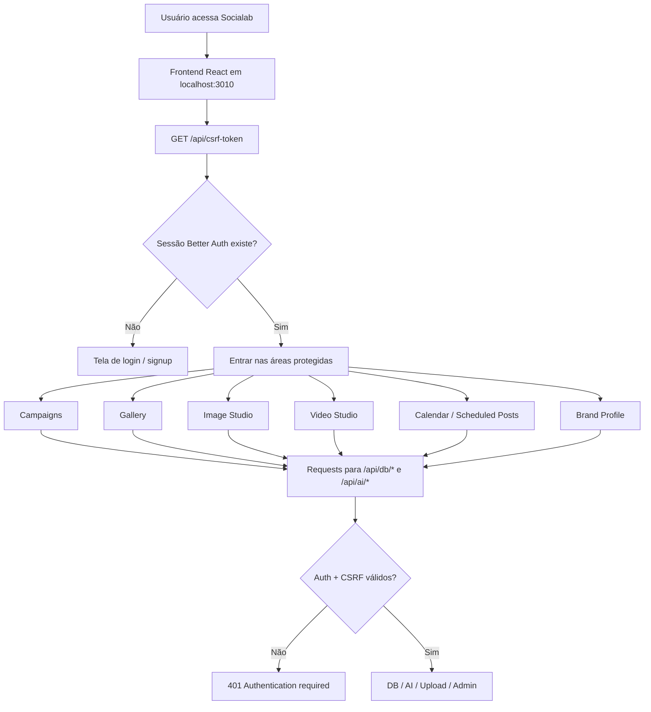
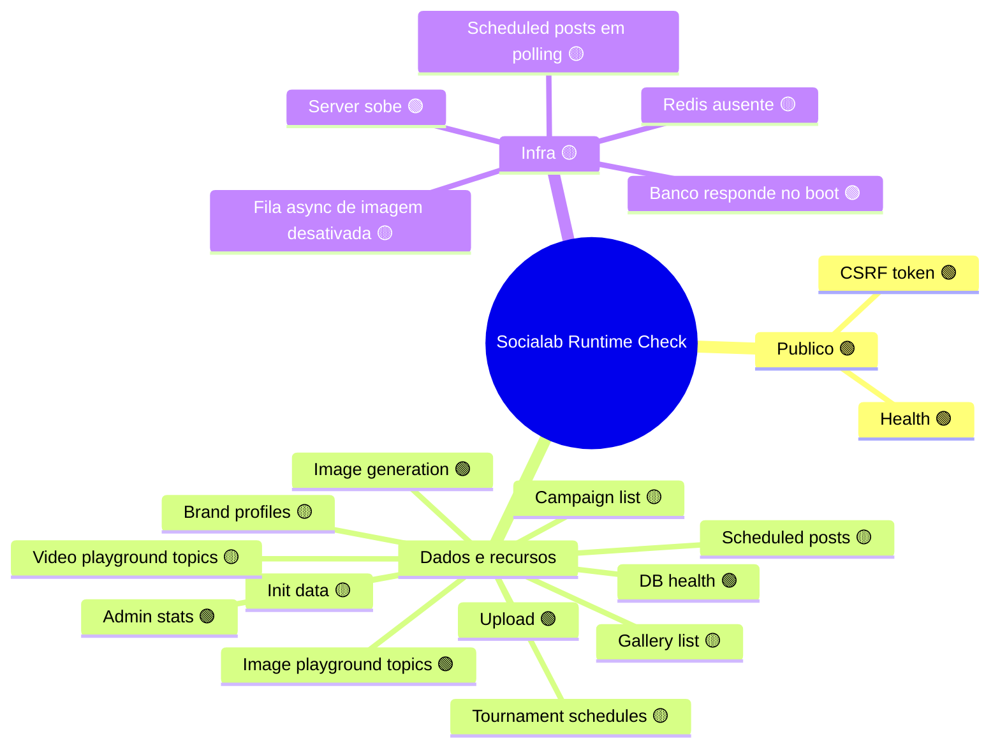
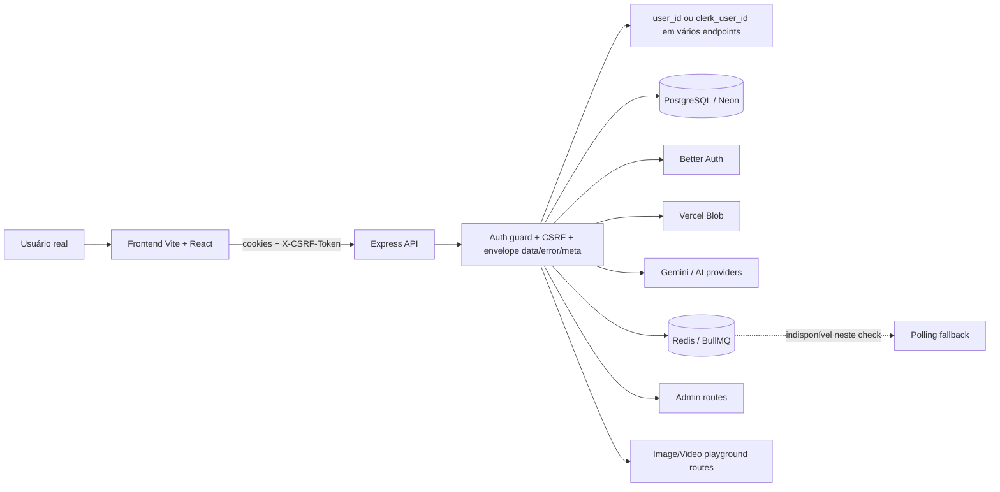

# Functional Baseline — Socialab (DirectorAi)

> Última atualização: 2026-03-18
> Testado por: Claude (opus) + Codex (GPT-5)
> Status geral: 🟡 Atenção

---

## 1. Identidade

### Propósito
Socialab (DirectorAi) é um **AI-powered growth toolkit para agências de marketing de poker**. Transforma conteúdo (transcrições, vídeos, posts) em campanhas de marketing completas — video clips, social media posts, ad creatives, tournament flyers e carrosséis.

### Público-alvo
Agências de marketing de poker e clubes de poker que precisam gerar conteúdo de marketing em escala.

### Core Value
Automação de criação de conteúdo visual e textual para marketing de poker usando IA generativa (texto, imagem, vídeo, áudio).

### MVP Features
1. **Campaign Generation** — upload de transcrição → geração automática de clips, posts, ads, carrosséis
2. **Image Studio** — geração e edição de imagens com IA (Gemini + fallback chain)
3. **Video Studio** — geração de vídeos com IA (Veo + FAL.ai)
4. **Tournament Flyers** — upload de planilha de torneios → geração de flyers diários/semanais
5. **Gallery** — biblioteca central de todos os assets gerados
6. **Calendar & Scheduling** — agendamento e publicação automática no Instagram
7. **AI Assistant** — chat com IA para criação de conteúdo (Vercel AI SDK + Claude Agent SDK)
8. **Brand Profile** — configuração de marca (cores, tom, logo) que influencia todas as gerações
9. **Admin Panel** — métricas, gestão de usuários, analytics de uso de IA

### Nice-to-have (Implementados)
- Multi-tenant com organizações (Better Auth organizations plugin)
- Provider chain para imagens (Gemini → Replicate → FAL.ai)
- Instagram multi-conta via Rube MCP
- Text-to-speech com Gemini TTS
- Extração de paleta de cores de imagens
- AI suggestions para erros no admin panel

### Stack
| Camada | Tecnologia |
|--------|-----------|
| Frontend | Vite 7 + React 19 + React Router 7 + TypeScript + Tailwind CSS 4 |
| Backend | Express 5 (Node.js/TypeScript), 57 módulos |
| Auth | Better Auth (self-hosted, cookie-based, organizations) |
| Database | PostgreSQL (Neon Serverless) |
| Storage | Vercel Blob |
| Queue | Redis + BullMQ (scheduled posts) |
| AI Text/Image | Google Gemini (`@google/genai`) |
| AI Chat | Vercel AI SDK (`ai` + `@ai-sdk/google`) |
| AI Agent | Claude Agent SDK (`@anthropic-ai/claude-agent-sdk`) |
| AI Video | Google Veo + FAL.ai |
| Instagram | Rube MCP (`https://rube.app/mcp`) |

---

## 2. Mapa Funcional

### 2.1 Dashboard / Campaign View (`/campaign`)

**Propósito:** Tela principal para criar e gerenciar campanhas de marketing a partir de transcrições.

**O que o usuário VÊ:**
- Upload form para transcrição/vídeo
- Tabs de campanha (Clips, Posts, Ads, Carousels)
- Preview cards dos assets gerados
- Status de geração
- Seletor de modelo de IA para imagens

**Ações disponíveis:**

| Ação | Método | Endpoint | Payload |
|------|--------|----------|---------|
| Criar campanha | POST | `/api/ai/campaign` | `{ transcript, options }` |
| Carregar campanha | GET | `/api/db/campaigns?id=X&include_content=true` | query params |
| Deletar campanha | DELETE | `/api/db/campaigns?id=X` | query params |
| Atualizar thumbnail clip | PATCH | `/api/db/campaigns?clip_id=X` | `{ thumbnail_url }` |
| Atualizar imagem de cena | PATCH | `/api/db/campaigns/scene?clip_id=X&scene_number=Y` | `{ image_url }` |
| Atualizar imagem de post | PATCH | `/api/db/posts?id=X` | `{ image_url }` |
| Atualizar imagem de ad | PATCH | `/api/db/ad-creatives?id=X` | `{ image_url }` |
| Gerar imagem IA | POST | `/api/ai/image` | `{ prompt, aspectRatio, size }` |
| Gerar texto IA | POST | `/api/ai/text` | `{ type, context }` |

**Dependências:** Auth (session), Brand Profile (opcional), dados de campanha
**Edge cases:** Campanha sem transcrição, geração falha parcialmente (alguns assets ok, outros não)

---

### 2.2 Campaigns List (`/campaigns`)

**Propósito:** Listar todas as campanhas do usuário com preview cards.

**O que o usuário VÊ:**
- Grid de campanhas com thumbnails
- Contagem de assets por campanha (clips, posts, ads, carousels)
- Botão de criar nova campanha

**Ações disponíveis:**

| Ação | Método | Endpoint | Payload |
|------|--------|----------|---------|
| Listar campanhas | GET | `/api/db/campaigns?user_id=X` | query params |
| Selecionar campanha | GET | `/api/db/campaigns?id=X&include_content=true` | query params |
| Deletar campanha | DELETE | `/api/db/campaigns?id=X` | query params |

**Dependências:** Auth (session)
**Edge cases:** Nenhuma campanha criada (empty state)

---

### 2.3 Carousels List (`/carousels`)

**Propósito:** Listar e gerenciar todos os carrosséis gerados.

**O que o usuário VÊ:**
- Lista de carrosséis com cover images
- Preview dos slides
- Nome da campanha associada
- Modal para criar carrossel via prompt IA

**Ações disponíveis:**

| Ação | Método | Endpoint | Payload |
|------|--------|----------|---------|
| Listar carrosséis | GET | `/api/db/carousels?user_id=X` | query params |
| Atualizar cover | PUT | `/api/db/carousels?carousel_id=X` | `{ cover_url }` |
| Atualizar slide image | PATCH | `/api/db/carousels?slide_id=X` | `{ image_url }` |
| Atualizar caption | PUT | `/api/db/carousels?carousel_id=X` | `{ caption }` |
| Gerar texto IA | POST | `/api/ai/text` | `{ type: "carousel_caption" }` |

**Dependências:** Auth (session), campanhas existentes
**Edge cases:** Carrossel sem slides, migration 007 não aplicada (coluna `carousel_image_urls`)

---

### 2.4 Tournament Flyers (`/flyer`)

**Propósito:** Gerenciar calendários de torneios e gerar flyers diários/semanais.

**O que o usuário VÊ:**
- Lista de schedules semanais
- Calendário semanal de torneios
- Placeholders para flyers diários
- Detalhes de eventos (jogos, buy-ins, payouts)
- Interface de geração de flyers

**Ações disponíveis:**

| Ação | Método | Endpoint | Payload |
|------|--------|----------|---------|
| Listar schedules | GET | `/api/db/tournaments/list?user_id=X` | query params |
| Criar schedule | POST | `/api/db/tournaments` | `{ events, schedule_data }` |
| Deletar schedule | DELETE | `/api/db/tournaments?id=X` | query params |
| Buscar eventos | GET | `/api/db/tournaments?schedule_id=X` | query params |
| Gerar flyer IA | POST | `/api/ai/flyer` | `{ event_data, brand_profile }` |
| Add event flyer | PUT | `/api/db/tournaments` (event_id) | `{ flyer_urls }` |
| Add daily flyer | PUT | `/api/db/tournaments` (schedule_id) | `{ daily_flyer_urls }` |
| Buscar daily flyers | GET | `/api/db/gallery/daily-flyers?week_schedule_id=X` | query params |

**Dependências:** Auth (session), Brand Profile (para geração), upload de planilha XLSX/CSV
**Edge cases:** Planilha com formato inesperado, evento sem horário

---

### 2.5 Calendar / Scheduling (`/calendar`)

**Propósito:** Agendar posts e publicar automaticamente no Instagram.

**O que o usuário VÊ:**
- Calendário mensal com posts agendados
- Preview dos posts por dia
- Status de publicação (scheduled, publishing, published, failed)
- Interface de agendamento

**Ações disponíveis:**

| Ação | Método | Endpoint | Payload |
|------|--------|----------|---------|
| Listar posts agendados | GET | `/api/db/scheduled-posts?user_id=X` | query params |
| Agendar post | POST | `/api/db/scheduled-posts` | `{ image_url, caption, scheduled_at }` |
| Editar post agendado | PUT | `/api/db/scheduled-posts?id=X` | `{ caption, scheduled_at }` |
| Deletar post agendado | DELETE | `/api/db/scheduled-posts?id=X` | query params |
| Retry post falho | POST | `/api/db/scheduled-posts/retry` | `{ id, user_id }` |

**Dependências:** Auth (session), conta Instagram conectada (via Rube), Redis (para queue)
**Edge cases:** Redis indisponível (fallback para polling), horário fora do range de publicação (7h-23:59 BRT), conta Instagram desconectada

---

### 2.6 Gallery (`/gallery`)

**Propósito:** Biblioteca central de todas as imagens geradas.

**O que o usuário VÊ:**
- Grid de imagens com metadata (prompt, modelo, fonte)
- Filtros por fonte/tipo
- Botões de ação rápida (post, schedule, style reference)
- Detalhes de aspecto ratio e tamanho

**Ações disponíveis:**

| Ação | Método | Endpoint | Payload |
|------|--------|----------|---------|
| Listar imagens | GET | `/api/db/gallery?user_id=X` | query params |
| Adicionar à galeria | POST | `/api/db/gallery` | `{ src_url, prompt, metadata }` |
| Atualizar metadata | PATCH | `/api/db/gallery?id=X` | `{ src_url, style_reference_name }` |
| Deletar imagem | DELETE | `/api/db/gallery?id=X` | query params |
| Marcar como publicada | PATCH | `/api/db/gallery?id=X` | `{ published: true }` |
| Definir como style reference | PATCH | `/api/db/gallery?id=X` | `{ style_reference_name }` |

**Dependências:** Auth (session)
**Edge cases:** Imagem com data URL em vez de HTTPS URL (migração antiga)

---

### 2.7 Image Studio (`/image-playground`)

**Propósito:** Geração avançada de imagens com IA — tópicos, batches, referências, estilos.

**O que o usuário VÊ:**
- Interface de geração de imagens
- Editor de prompts
- Upload de imagem de referência (estilo, produto, pessoa)
- Seletores de aspecto ratio e tamanho (1K/2K/4K)
- Histórico de gerações por tópico
- Preview com thumbnail
- Modos: Instagram, AI Influencer, Product Hero, Exploded Product, Brand Identity

**Ações disponíveis:**

| Ação | Método | Endpoint | Payload |
|------|--------|----------|---------|
| Listar tópicos | GET | `/api/image-playground/topics` | - |
| Criar tópico | POST | `/api/image-playground/topics` | `{ name }` |
| Atualizar tópico | PUT | `/api/image-playground/topics/:id` | `{ name }` |
| Deletar tópico | DELETE | `/api/image-playground/topics/:id` | - |
| Listar batches | GET | `/api/image-playground/topics/:id/batches` | - |
| Gerar imagem | POST | `/api/image-playground/generate` | `{ prompt, aspectRatio, size, references }` |
| Status da geração | GET | `/api/image-playground/status/:id` | - |
| Retry geração | POST | `/api/image-playground/generation/:id/retry` | - |
| Deletar geração | DELETE | `/api/image-playground/generation/:id` | - |
| Deletar batch | DELETE | `/api/image-playground/batch/:id` | - |
| Gerar título IA | POST | `/api/image-playground/generate-title` | `{ prompt }` |

**Dependências:** Auth (session), Brand Profile (opcional), Gemini API key
**Edge cases:** Geração com referência de 25MB+ (limite), safety block do Gemini, timeout em 4K

---

### 2.8 Video Studio (`/playground`)

**Propósito:** Geração de vídeos com IA — cenas, composições, preview.

**O que o usuário VÊ:**
- Interface de geração de vídeo
- Editor de cenas
- Preview de vídeo
- Seletor de modelo e aspecto ratio
- Opções de resolução (720p/1080p)

**Ações disponíveis:**

| Ação | Método | Endpoint | Payload |
|------|--------|----------|---------|
| Listar tópicos | GET | `/api/video-playground/topics` | - |
| Criar tópico | POST | `/api/video-playground/topics` | `{ name }` |
| Atualizar tópico | PUT | `/api/video-playground/topics/:id` | `{ name }` |
| Deletar tópico | DELETE | `/api/video-playground/topics/:id` | - |
| Listar sessions | GET | `/api/video-playground/topics/:id/sessions` | - |
| Gerar vídeo | POST | `/api/video-playground/generate` | `{ prompt, aspectRatio, resolution }` |
| Status da geração | GET | `/api/video-playground/generation/:id` | - |
| Atualizar geração | PUT | `/api/video-playground/generation/:id` | `{ status, metadata }` |
| Deletar geração | DELETE | `/api/video-playground/generation/:id` | - |
| Gerar título IA | POST | `/api/video-playground/generate-title` | `{ prompt }` |
| Gerar vídeo direto | POST | `/api/ai/video` | `{ prompt, aspectRatio }` |
| Gerar imagem de cena | POST | `/api/ai/image` | `{ prompt }` |

**Dependências:** Auth (session), Gemini/FAL.ai API keys, Brand Profile (opcional)
**Edge cases:** Geração de vídeo demora minutos, quota de Veo

---

### 2.9 AI Assistant (Chat lateral)

**Propósito:** Chat com IA para criação assistida de conteúdo — integrado a todas as views.

**O que o usuário VÊ:**
- Painel lateral de chat
- Mensagens com suporte a markdown
- Referência de imagens do gallery
- Geração inline de imagens/textos
- Content mentions (`@gallery:uuid`, `@campaign:uuid`, etc.)

**Ações disponíveis:**

| Ação | Método | Endpoint | Payload |
|------|--------|----------|---------|
| Chat streaming | POST | `/api/chat` | `{ messages, model }` |
| Agent stream (Studio) | POST | `/api/agent/studio/stream` | `{ message, threadId }` |
| Agent answer | POST | `/api/agent/studio/answer` | `{ threadId, answer }` |
| Histórico | GET | `/api/agent/studio/history?threadId=X` | query params |
| Reset thread | POST | `/api/agent/studio/reset` | `{ threadId }` |
| Content search | GET | `/api/agent/studio/content-search` | query params |
| Files list | GET | `/api/agent/studio/files` | query params |
| Legacy assistant | POST | `/api/ai/assistant` | `{ messages }` |

**Dependências:** Auth (session), Gemini API key (chat), Anthropic API key (Studio Agent)
**Edge cases:** Timeout de interação (60s), loop guard (8 chamadas iguais em 45s), client disconnect

---

### 2.10 Admin Panel (`/admin`)

**Propósito:** Painel administrativo para super admins — métricas, usuários, analytics.

**Sub-rotas:**

| Rota | Componente | Propósito |
|------|-----------|-----------|
| `/admin` | OverviewPage | Dashboard com métricas do sistema |
| `/admin/users` | UsersPage | Gestão de usuários |
| `/admin/organizations` | OrganizationsPage | Gestão de organizações |
| `/admin/usage` | UsagePage | Analytics de uso de IA |
| `/admin/logs` | LogsPage | Viewer de logs do sistema |

**Ações disponíveis:**

| Ação | Método | Endpoint | Payload |
|------|--------|----------|---------|
| Stats overview | GET | `/api/admin/stats` | - |
| Listar usuários | GET | `/api/admin/users` | query params (search, pagination) |
| Listar organizações | GET | `/api/admin/organizations` | query params |
| Usage analytics | GET | `/api/admin/usage` | query params (group_by, period) |
| Listar logs | GET | `/api/admin/logs` | query params (action, severity) |
| Detalhe do log | GET | `/api/admin/logs/:id` | - |
| AI suggestions para erro | POST | `/api/admin/logs/:id/ai-suggestions` | - |

**Dependências:** Auth (session), `SUPER_ADMIN_EMAILS` env var
**Edge cases:** Acesso negado se email não está na lista de super admins

---

### 2.11 Brand Profile (Onboarding / Settings)

**Propósito:** Configuração do perfil de marca que influencia todas as gerações de IA.

**O que o usuário VÊ:**
- Form de onboarding (primeira vez)
- Modal de settings
- Campos: nome, logo, cores, tom de voz, público-alvo

**Ações disponíveis:**

| Ação | Método | Endpoint | Payload |
|------|--------|----------|---------|
| Buscar perfil | GET | `/api/db/brand-profiles?user_id=X` | query params |
| Criar perfil | POST | `/api/db/brand-profiles` | `{ name, colors, tone }` |
| Atualizar perfil | PUT | `/api/db/brand-profiles?id=X` | `{ name, colors, tone }` |

**Dependências:** Auth (session)
**Edge cases:** Sem perfil criado (redireciona para onboarding)

---

### 2.12 Instagram Accounts (Settings)

**Propósito:** Conectar contas do Instagram para publicação automática.

**Ações disponíveis:**

| Ação | Método | Endpoint | Payload |
|------|--------|----------|---------|
| Listar contas | GET | `/api/db/instagram-accounts` | query params |
| Conectar conta | POST | `/api/db/instagram-accounts` | `{ rube_token }` |
| Atualizar token | PUT | `/api/db/instagram-accounts?id=X` | `{ rube_token }` |
| Desconectar conta | DELETE | `/api/db/instagram-accounts?id=X` | query params |

**Dependências:** Auth (session), Rube MCP token
**Edge cases:** Token inválido, conta já conectada

---

### 2.13 Endpoints Utilitários

| Ação | Método | Endpoint | Propósito |
|------|--------|----------|-----------|
| Health check | GET | `/health` | Status do servidor |
| DB health | GET | `/api/db/health` | Conectividade do banco |
| CSRF token | GET | `/api/csrf-token` | Token para requests mutantes |
| Init data | GET | `/api/db/init` | Fetch unificado de dados iniciais |
| Upload file | POST | `/api/upload` | Upload para Vercel Blob |
| Proxy video | POST | `/api/proxy-video` | Proxy de vídeo externo |
| Extract colors | POST | `/api/ai/extract-colors` | Extrai paleta de cores |
| Enhance prompt | POST | `/api/ai/enhance-prompt` | Melhora prompt de imagem |
| Convert prompt | POST | `/api/ai/convert-prompt` | Converte prompt para JSON |
| Speech | POST | `/api/ai/speech` | Text-to-speech |
| Edit image | POST | `/api/ai/edit-image` | Edição de imagem com IA |
| Rube proxy | POST | `/api/rube` | Proxy para Instagram API |
| Feedback | POST | `/api/feedback` | Enviar feedback |

---

## 3. Health Matrix

### Runtime Health Check — 2026-03-18

> Ambiente testado: `npm run dev` em `http://localhost:3002`
> Frontend validado via Chrome CDP na aba autenticada `http://localhost:3010/campaign`
> Observação: os `curl`/requests sem sessão ou sem `user_id` geraram falsos negativos. A matriz abaixo prioriza o resultado real obtido a partir da sessão autenticada do navegador.

| # | Feature | Request real | Resultado | Shape verificado | Status | Notas |
|---|---------|--------------|-----------|------------------|--------|-------|
| 1 | Auth Init / CSRF | `GET /api/csrf-token` | `200` | Envelope `{ data, error, meta }`, `data.csrfToken`, header `X-CSRF-Token`, cookie `csrf_token` | 🟢 OK | Endpoint público respondeu corretamente e emitiu token/cookie |
| 2 | Campaign List | `GET /api/db/campaigns?user_id=<authUserId>` | `200` | `{ data: [], error: null, meta: null }` | 🟡 PARCIAL | Endpoint funciona com sessão + `user_id`, mas a conta testada não tem campanhas |
| 3 | Gallery List | `GET /api/db/gallery?user_id=<authUserId>` | `200` | `{ data: [], error: null, meta: null }` | 🟡 PARCIAL | Endpoint funciona, mas retornou galeria vazia |
| 4 | Image Generation | `POST /api/ai/image` com `brandProfile: {}` | `200` | `{ data: { success, imageUrl, model }, error: null, meta: null }` | 🟢 OK | Geração concluiu e retornou URL pública em Blob |
| 5 | Image Playground Topics | `GET /api/image-playground/topics` | `200` | `{ data: { topics }, error: null, meta: null }` | 🟢 OK | Tópicos existentes retornaram dados reais |
| 6 | Brand Profiles | `GET /api/db/brand-profiles?user_id=<authUserId>` | `200` | `{ data: null, error: null, meta: null }` | 🟡 PARCIAL | Endpoint funciona, mas o usuário testado não tem brand profile configurado |
| 7 | Scheduled Posts | `GET /api/db/scheduled-posts?user_id=<authUserId>` | `200` | `{ data: [], error: null, meta: null }` | 🟡 PARCIAL | Endpoint funciona, mas sem posts agendados para validar payload real |
| 8 | Admin Stats | `GET /api/admin/stats` | `403` | `{ data: null, error: { message }, meta: null }` | 🟢 OK | Com sessão autenticada de usuário comum, o guard de super admin respondeu corretamente |
| 9 | Health Check | `GET /health` | `200` | Envelope `{ data, error, meta }` com `data.status = "ok"` | 🟢 OK | Startup validado e rota pública saudável |
| 10 | DB Health | `GET /api/db/health` | `200` | `{ data: { status, timestamp }, error: null, meta: null }` | 🟢 OK | Banco respondeu como `healthy` na sessão autenticada |
| 11 | Upload | `POST /api/upload` multipart | `200` para PNG válido; `400` para `.txt` | `{ data: { success, url, filename, size }, error: null, meta: null }` | 🟢 OK | Upload funciona para MIME aceito e rejeita `text/plain` com erro claro |
| 12 | Video Playground Topics | `GET /api/video-playground/topics` | `200` | `{ data: { topics: [] }, error: null, meta: null }` | 🟡 PARCIAL | Endpoint funciona, mas sem tópicos para validar listagem real |
| 13 | Tournament Schedules | `GET /api/db/tournaments/list?user_id=<authUserId>` | `200` | `{ data: { schedules: [] }, error: null, meta: null }` | 🟡 PARCIAL | Contrato correto, mas sem schedules na conta testada |
| 14 | Init Data | `GET /api/db/init?clerk_user_id=<authUserId>` | `200` | `{ data: { brandProfile, gallery, scheduledPosts, campaigns, ... }, error: null, meta: null }` | 🟡 PARCIAL | Shape correto, porém todos os coletores vieram vazios/nulos |
| 15 | Runtime Infra | Boot do `npm run dev` | Server sobe; DB aquece; Redis indisponível | Logs reais de startup | 🟡 PARCIAL | App sobe sem crash, mas `scheduled posts` ficam em polling e a fila async de imagem fica desativada |

---

## 4. Issues Funcionais

### P0 — Core Quebrado
**Nenhum P0 confirmado neste check.** O app sobe, autentica, gera imagem e faz upload com arquivo aceito.

### P1 — Importante (Atenção)

| # | Issue | Área | Impacto | Ação |
|---|-------|------|---------|------|
| P1-1 | Baseline antigo sobre `src/App.tsx` ficou obsoleto: o arquivo hoje tem 54 linhas físicas e atua como composition root | Frontend | O risco descrito anteriormente não procede mais | Remover esse item como debt funcional aberto |
| P1-2 | Baseline antigo sobre `src/components/tabs/clips/ClipCard.tsx` ficou obsoleto: o arquivo hoje é um barrel de 4 linhas | Frontend | O “componente gigante” não existe mais nesse path | Remover esse item como debt funcional aberto |
| P1-3 | Baseline antigo sobre `src/services/apiClient.ts` ficou obsoleto: o arquivo hoje tem 111 linhas e faz re-export modular | Frontend | O problema de arquivo monolítico foi substancialmente resolvido | Manter a API modular e evitar regressão para barrel inchado |
| P1-4 | O item “66+ usos de any” também ficou desatualizado: no código de app/servidor fora de testes restou 1 uso explícito justificado em `server/lib/agent/claude/tool-registry.ts` | Frontend/Backend | Debt de type safety caiu muito, mas não zerou | Encerrar o issue antigo e decidir se esse `any` residual será removido ou documentado como exceção |
| P1-5 | Vários endpoints autenticados ainda exigem `user_id`/`clerk_user_id` explícito no contrato e retornam `400 Validation failed` quando ele não é enviado | API/Auth | Request “natural” com sessão válida pode falhar mesmo autenticado | Reduzir dependência de `user_id` vindo do client ou inferir da sessão no backend |
| P1-6 | Redis indisponível no boot; app entra em fallback para polling e desliga fila async de imagem | Infra | Degrada scheduled posts e qualquer fluxo que dependa de fila | Subir Redis no ambiente de QA/dev antes da próxima bateria |

### P2 — Edge Cases

| # | Issue | Área | Impacto | Ação |
|---|-------|------|---------|------|
| P2-1 | A conta autenticada usada no navegador está vazia em campanhas, galeria, scheduled posts, torneios e brand profile | Produto/QA | Vários endpoints responderam `200`, mas sem massa real para validar comportamento completo | Criar seed de QA com dados representativos |
| P2-2 | `POST /api/upload` rejeita corretamente `text/plain`; o exemplo de teste com `.txt` mede validação, não sucesso funcional de upload | API/QA | Pode gerar interpretação errada do health check | Trocar o fixture padrão para um PNG/JPG mínimo quando a meta for validar sucesso |
| P2-3 | O envelope de resposta está consistente (`data/error/meta`) tanto em sucesso quanto em erro | API | Ponto positivo, mas ainda precisa ser observado com datasets mais ricos | Repetir o check com seed populado |

### P3 — Cosmético / Debt

| # | Issue | Área | Impacto | Ação |
|---|-------|------|---------|------|
| P3-1 | O baseline anterior estava otimista demais e confundia leitura estática com feature validada | Documentação | Pode induzir decisão errada de produto/QA | Manter esta seção sempre baseada em teste real |

---

## 5. Changelog

| Data | Autor | Mudança |
|------|-------|---------|
| 2026-03-18 | Claude (opus) | Criação inicial do Functional Baseline |
| 2026-03-18 | Codex (GPT-5) | Runtime health check real em `localhost:3002`, atualização da Health Matrix, Issues, parecer e diagramas |

---

## 6. Parecer do Agente

O app sobe de verdade, conecta no banco, responde em `http://localhost:3002` e expõe `GET /health`, `GET /api/db/health` e `GET /api/csrf-token` saudáveis. Pela sessão autenticada já aberta no Chrome em `http://localhost:3010/campaign`, foi possível validar o comportamento real do usuário comum sem depender de credenciais E2E nas envs.

O resultado mudou bastante em relação ao primeiro passe: campanhas, gallery, scheduled posts, tournaments e init data responderam `200` quando chamados com `user_id` ou `clerk_user_id`; image generation e upload também responderam `200` com payload válido; e `admin/stats` retornou `403`, o que confirma corretamente a proteção de super admin. O principal problema funcional encontrado não é auth, e sim contrato: vários endpoints autenticados ainda exigem `user_id` explícito, então uma request com sessão válida mas sem esse parâmetro cai em `400 Validation failed`.

Há ainda um ponto claro de degradação de ambiente: o boot registrou Redis indisponível, então scheduled posts operam em fallback por polling e a fila assíncrona de imagem não entra no modo nominal. Veredicto honesto: o app está funcional em runtime para os fluxos básicos testados, mas segue em estado `🟡` porque a conta usada está quase vazia e a infraestrutura de fila não está no modo normal.

---

## 7. Diagramas

### User Flow

### Feature Map

### Arquitetura

