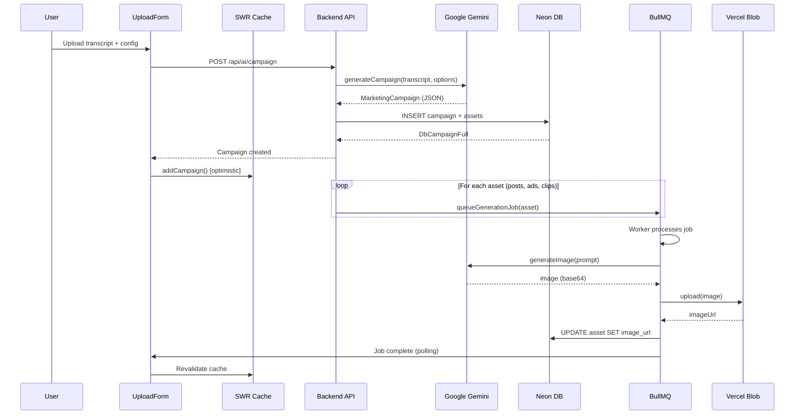
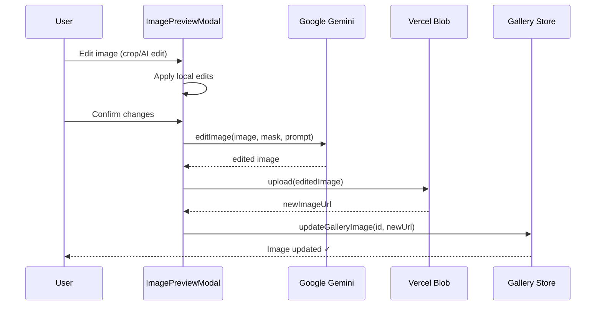
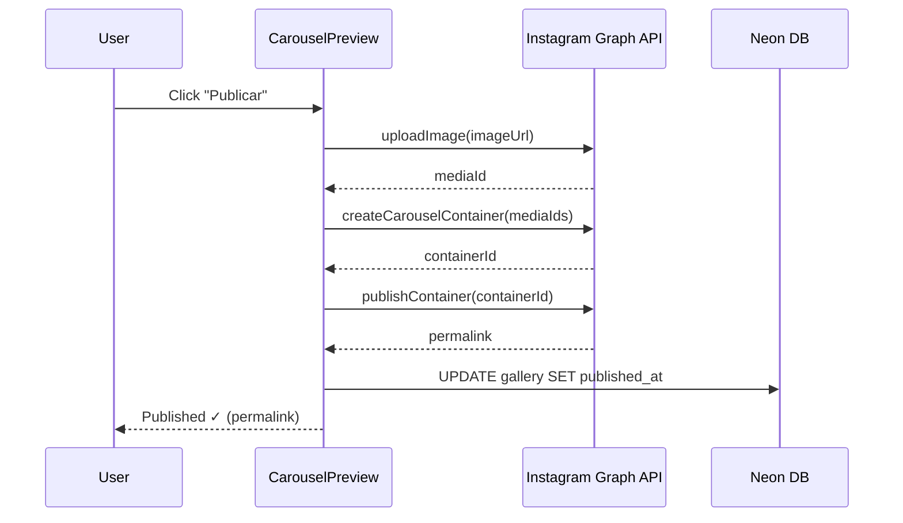

# 01. Arquitetura do Sistema de Campanhas

> **Visão completa da arquitetura end-to-end**
>
> Este documento descreve a arquitetura completa do sistema de campanhas, incluindo fluxo de dados, componentes principais, integrações e padrões de design.

---

## 📋 Índice

1. [Visão Geral](#visão-geral)
2. [Stack Tecnológica](#stack-tecnológica)
3. [Arquitetura em Camadas](#arquitetura-em-camadas)
4. [Fluxo de Dados End-to-End](#fluxo-de-dados-end-to-end)
5. [Componentes Principais](#componentes-principais)
6. [Gerenciamento de Estado](#gerenciamento-de-estado)
7. [Sistema de Abas](#sistema-de-abas)
8. [Integração com IA](#integração-com-ia)
9. [Background Jobs](#background-jobs)
10. [Storage e Mídia](#storage-e-mídia)
11. [Padrões de Design](#padrões-de-design)
12. [Segurança e Permissões](#segurança-e-permissões)

---

## Visão Geral

### O Que é o Sistema de Campanhas?

O Sistema de Campanhas é uma plataforma completa para **geração automatizada de conteúdo de marketing** usando IA (Google Gemini). A partir de um transcript ou texto descritivo, o sistema gera automaticamente:

- 📹 **Video Clips**: Scripts completos com cenas, narração e visual
- 📱 **Posts Sociais**: Conteúdo otimizado para Instagram, Facebook, Twitter, LinkedIn
- 📢 **Anúncios**: Criativos para Facebook Ads e Google Ads
- 🎞️ **Carrosséis**: Múltiplos slides para Instagram

### Principais Características

- ✅ **Geração com IA**: Usa Google Gemini para gerar conteúdo contextualizado
- ✅ **Background Jobs**: Processamento assíncrono com BullMQ
- ✅ **Multi-plataforma**: Suporte a 6+ plataformas sociais/publicitárias
- ✅ **Editor de Imagens**: Editor avançado com IA para ajustes
- ✅ **Publicação Direta**: Integração com Instagram Graph API
- ✅ **Agendamento**: Sistema de calendário completo
- ✅ **Multi-tenant**: Suporte a organizações (via Clerk)

---

## Stack Tecnológica

### Frontend

```typescript
{
  "framework": "React 19.1.1 + TypeScript 5.9.3",
  "meta-framework": "Vite 7.3.0 (build) + Express (dev server)",
  "routing": "react-router-dom 7.11.0",
  "styling": "TailwindCSS 4.1.18 + Radix UI",
  "state-management": {
    "server-state": "SWR 2.3.8 (cache + fetching)",
    "client-state": "Zustand 5.0.10 (stores)",
    "context": "React Context (chat, auth)"
  },
  "ui-components": [
    "@lobehub/ui 4.21.0",
    "@radix-ui/* (tooltips, modals, etc)",
    "lucide-react 0.562.0 (icons)",
    "framer-motion 12.24.10 (animations)"
  ]
}
```

### Backend

```typescript
{
  "runtime": "Node.js (Express 5.2.1 server)",
  "database": "@neondatabase/serverless 1.0.2 (Postgres)",
  "storage": "@vercel/blob 2.0.0",
  "queue": "BullMQ 5.66.4 + IORedis 5.8.2",
  "ai": {
    "gemini": "@google/genai 1.17.0",
    "vercel-ai": "ai 6.0.37 + @ai-sdk/google 3.0.9"
  },
  "auth": "@clerk/backend 2.29.0 + @clerk/express 1.7.60",
  "validation": "zod 4.3.5"
}
```

### Infraestrutura

- **Database**: Neon Serverless Postgres
- **Storage**: Vercel Blob Storage
- **Queue**: Redis (IORedis) + BullMQ
- **Auth**: Clerk (multi-tenant)
- **Hosting**: Vercel (recomendado)
- **AI**: Google Generative AI (Gemini)

---

## Arquitetura em Camadas

```
┌──────────────────────────────────────────────────────────────┐
│                     PRESENTATION LAYER                        │
│  ┌────────────┐  ┌────────────┐  ┌────────────┐             │
│  │ Dashboard  │  │   Tabs     │  │  Modals    │             │
│  │ Components │  │  (4 types) │  │  & Panels  │             │
│  └────────────┘  └────────────┘  └────────────┘             │
└───────────────────────┬──────────────────────────────────────┘
                        │
┌───────────────────────┼──────────────────────────────────────┐
│                  STATE LAYER                                  │
│  ┌────────────┐  ┌────────────┐  ┌────────────┐             │
│  │    SWR     │  │  Zustand   │  │  Context   │             │
│  │  (server)  │  │  (client)  │  │   (chat)   │             │
│  └────────────┘  └────────────┘  └────────────┘             │
└───────────────────────┬──────────────────────────────────────┘
                        │
┌───────────────────────┼──────────────────────────────────────┐
│                   API CLIENT LAYER                            │
│  ┌────────────┐  ┌────────────┐  ┌────────────┐             │
│  │ Campaigns  │  │  Gallery   │  │    Jobs    │             │
│  │    API     │  │    API     │  │    API     │             │
│  └────────────┘  └────────────┘  └────────────┘             │
└───────────────────────┬──────────────────────────────────────┘
                        │ HTTP/REST
┌───────────────────────┼──────────────────────────────────────┐
│                  BACKEND LAYER                                │
│  ┌────────────┐  ┌────────────┐  ┌────────────┐             │
│  │ Express    │  │  AI (Gemini)│  │  BullMQ    │             │
│  │ API Routes │  │  Service   │  │  Workers   │             │
│  └────────────┘  └────────────┘  └────────────┘             │
└───────────────────────┬──────────────────────────────────────┘
                        │
┌───────────────────────┼──────────────────────────────────────┐
│                   DATA LAYER                                  │
│  ┌────────────┐  ┌────────────┐  ┌────────────┐             │
│  │   Neon     │  │   Redis    │  │   Vercel   │             │
│  │ Postgres   │  │   (Queue)  │  │    Blob    │             │
│  └────────────┘  └────────────┘  └────────────┘             │
└──────────────────────────────────────────────────────────────┘
```

---

## Fluxo de Dados End-to-End

### 1. Criação de Campanha (Fluxo Completo)



### 2. Edição de Imagem (Fluxo)



### 3. Publicação no Instagram (Fluxo)



---

## Componentes Principais

### Hierarquia de Componentes

```
App.tsx (root)
├── AuthWrapper (Clerk authentication)
├── ChatProvider (assistant context)
├── BackgroundJobsProvider (jobs monitoring)
│
└── Dashboard (main container)
    │
    ├── FloatingSidebar (navigation)
    │
    ├── View: "campaigns" (list)
    │   └── CampaignsList
    │       └── CampaignCard[] (grid)
    │
    ├── View: "campaign" (single)
    │   ├── UploadForm (create new)
    │   │   └── GenerationOptionsModal
    │   │
    │   └── Tabs (view/edit)
    │       ├── ClipsTab
    │       │   └── ClipCard[]
    │       ├── PostsTab
    │       │   └── PostCard[]
    │       │       └── Platform Previews (Instagram, Facebook, etc)
    │       ├── AdCreativesTab
    │       │   └── AdCreativeCard[]
    │       └── CarouselTab
    │           ├── CampaignCarouselCard[]
    │           └── ClipCarouselCard[]
    │               └── CarouselPreview (drag-drop reorder)
    │
    ├── View: "gallery"
    │   └── GalleryView (grid + filters)
    │       └── ImagePreviewModal (editor)
    │
    ├── View: "calendar"
    │   └── CalendarView
    │       └── CampaignAccordion (select images)
    │
    └── View: "playground"
        └── PlaygroundView (assistant)
```

### Componentes Críticos

#### 1. **Dashboard** (`src/components/dashboard/Dashboard.tsx`)

Container principal que gerencia:
- Navegação entre views (campaigns, campaign, gallery, calendar, playground)
- Estado global compartilhado
- Props drilling para todos os sub-componentes

**Props principais**:
```typescript
interface DashboardProps {
  // Brand & Campaign
  brandProfile: BrandProfile;
  campaign: MarketingCampaign | null;

  // Generation
  onGenerate: (input: ContentInput, options: GenerationOptions) => void;
  isGenerating: boolean;

  // Gallery
  galleryImages: GalleryImage[];
  onAddImageToGallery: (image: Omit<GalleryImage, "id">) => GalleryImage;

  // Navigation
  activeView: View;
  onViewChange: (view: View) => void;

  // ... + 30 outras props
}
```

#### 2. **CampaignsList** (`src/components/campaigns/CampaignsList.tsx`)

Listagem de campanhas com:
- Grid de `CampaignCard`
- Preview de imagens (clip, post, ad)
- Contadores de assets
- Delete com confirmação
- Visualização do prompt original

**Hook principal**:
```typescript
const { campaigns, isLoading, removeCampaign } = useCampaigns(userId, organizationId);
```

#### 3. **UploadForm** (`src/components/campaigns/UploadForm.tsx`)

Formulário de criação com:
- Upload de transcript (texto/áudio)
- Upload de imagens de produto
- Seleção de tom de voz
- Seleção de modelo criativo (IA)
- Modal de opções (`GenerationOptionsModal`)

#### 4. **Sistema de Abas**

4 abas principais:

| Aba | Arquivo | Conteúdo |
|-----|---------|----------|
| **Clips** | `src/components/tabs/ClipsTab.tsx` | Video clips com cenas |
| **Posts** | `src/components/tabs/PostsTab.tsx` | Posts sociais (4 plataformas) |
| **Ads** | `src/components/tabs/AdCreativesTab.tsx` | Anúncios (2 plataformas) |
| **Carousels** | `src/components/carousel/CarouselTab.tsx` | Carrosséis (2 tipos) |

#### 5. **CarouselTab** (`src/components/carousel/CarouselTab.tsx`)

Tab mais complexa com:
- **Campaign Carousels**: Carrosséis gerados na campanha
- **Clip Carousels**: Carrosséis criados das cenas de clips
- Geração progressiva com pause/resume
- Drag-and-drop para reordenar
- Preview em tempo real
- Download como ZIP
- Publicação no Instagram

#### 6. **ImagePreviewModal** (`src/components/image-preview/ImagePreviewModal.tsx`)

Editor avançado com:
- Crop e resize
- Filtros (brilho, contraste, saturação)
- AI Edit (edição guiada por IA)
- Remoção de background
- Canvas de desenho (para masks)
- Comparação antes/depois
- Detecção de texto (Tesseract.js)

---

## Gerenciamento de Estado

### Arquitetura de Estado

```
┌─────────────────────────────────────────────────────────┐
│                   SWR (Server State)                     │
│  Cache-first strategy com revalidação controlada        │
├──────────────────────────────────────────────────────────┤
│ useInitialData()    - Single fetch (/api/db/init)       │
│ useCampaigns()      - Campaigns list                     │
│ useGalleryImages()  - Gallery (paginated)                │
│ useScheduledPosts() - Calendar posts                     │
│ useTournamentData() - Tournament events                  │
└──────────────────┬──────────────────────────────────────┘
                   │
┌──────────────────┴──────────────────────────────────────┐
│                 Zustand (Client State)                   │
│  Stores para estado local e UI                          │
├──────────────────────────────────────────────────────────┤
│ useJobsStore()     - Background jobs tracking           │
│ useClipsStore()    - Clips state (optional)              │
│ useCarouselStore() - Carousels state (optional)          │
│ useGalleryStore()  - Gallery filters (optional)          │
└──────────────────┬──────────────────────────────────────┘
                   │
┌──────────────────┴──────────────────────────────────────┐
│              React Context (Scoped State)                │
│  Contexts para funcionalidades específicas              │
├──────────────────────────────────────────────────────────┤
│ ChatContext         - Assistant chat history            │
│ BackgroundJobsContext - Jobs monitoring & notifications │
└──────────────────────────────────────────────────────────┘
```

### 1. SWR - Server State (Primary)

**Arquivo**: `src/hooks/useAppData.tsx`

#### `useInitialData()` - Unified Fetch

```typescript
// Carrega TODOS os dados em 1 requisição
const data = useInitialData(userId, organizationId);

// Retorna:
{
  brandProfile: DbBrandProfile | null,
  gallery: DbGalleryImage[],        // Primeiros 20
  scheduledPosts: DbScheduledPost[],
  campaigns: DbCampaign[],          // Primeiros 10
  tournaments: DbTournamentEvent[],
  schedules: WeekScheduleWithCount[],
  weekSchedule: WeekScheduleInfo | null
}
```

**Endpoint**: `GET /api/db/init`

**Vantagens**:
- 1 requisição ao invés de 6+
- Popula todos os caches SWR
- Reduz latência inicial

#### `useCampaigns()` - Cache-only Hook

```typescript
const {
  campaigns,           // DbCampaign[]
  isLoading,
  error,
  refresh,             // () => void

  // Optimistic updates
  addCampaign,         // (campaign: DbCampaign) => void
  removeCampaign,      // (campaignId: string) => void
  updateCampaign,      // (id: string, updates: Partial<DbCampaign>) => void
} = useCampaigns(userId, organizationId);
```

**Características**:
- Lê do cache (populado por `useInitialData`)
- Não faz fetch próprio (fallbackData)
- Updates otimistas via `mutate()`

#### Configuração SWR

```typescript
const swrConfig = {
  revalidateOnFocus: false,      // Não refetch ao focar tab
  revalidateOnReconnect: false,  // Não refetch ao reconectar
  dedupingInterval: 300000,      // 5 minutos
  errorRetryCount: 2,            // 2 tentativas em erro
  shouldRetryOnError: true,
};
```

### 2. Zustand - Client State

**Arquivo**: `src/stores/jobsStore.ts`

#### `useJobsStore()` - Background Jobs

```typescript
interface JobsState {
  jobs: Record<string, ActiveJob>;

  // Methods
  addJob: (job: ActiveJob) => void;
  updateJob: (jobId: string, updates: Partial<ActiveJob>) => void;
  removeJob: (jobId: string) => void;
  clearJobs: () => void;

  // Polling
  pollGenerationJob: (jobId: string) => Promise<void>;

  // Listeners
  onJobComplete: (callback: (job: ActiveJob) => void) => void;
  onJobFailed: (callback: (job: ActiveJob) => void) => void;
}

// Persistido em localStorage com DevTools
export const useJobsStore = create<JobsState>()(
  devtools(
    persist(
      (set, get) => ({
        // ...implementation
      }),
      { name: 'jobs-storage' }
    )
  )
);
```

**Características**:
- Persiste em localStorage
- DevTools para debug
- Polling automático
- Notificações via listeners

### 3. React Context

#### ChatContext

**Arquivo**: `src/contexts/ChatContext.tsx`

```typescript
interface ChatContextType {
  messages: ChatMessage[];
  isLoading: boolean;
  sendMessage: (message: string, image?: ChatReferenceImage) => void;
  clearHistory: () => void;
}
```

#### BackgroundJobsContext

**Arquivo**: `src/hooks/useBackgroundJobs.tsx`

```typescript
interface BackgroundJobsContextType {
  activeJobs: ActiveJob[];
  completedJobs: CompletedJob[];
  failedJobs: FailedJob[];

  startJob: (job: ActiveJob) => void;
  cancelJob: (jobId: string) => void;
  retryJob: (jobId: string) => void;
}
```

---

## Sistema de Abas

### Estrutura de Tabs

Cada aba segue um padrão consistente:

```typescript
interface TabProps {
  // Data
  items: T[];                    // Clips, Posts, Ads, ou Carousels

  // Brand context
  brandProfile: BrandProfile;
  campaignId?: string;

  // Gallery integration
  galleryImages?: GalleryImage[];
  onAddImageToGallery: (image: Omit<GalleryImage, "id">) => GalleryImage;
  onUpdateGalleryImage?: (imageId: string, newImageSrc: string) => void;

  // Style references
  selectedStyleReference?: StyleReference | null;
  chatReferenceImage?: ChatReferenceImage | null;
  productImages?: ImageFile[] | null;

  // Actions
  onQuickPost?: (image: GalleryImage) => void;
  onSchedulePost?: (image: GalleryImage) => void;
  onPublishCarousel?: (imageUrls: string[], caption: string) => Promise<void>;
}
```

### 1. ClipsTab

**Arquivo**: `src/components/tabs/ClipsTab.tsx`

**Responsabilidades**:
- Renderiza `ClipCard` para cada clip
- Gera thumbnails
- Gera imagens de cenas
- Extra instructions para customização

**Estrutura de dados**:
```typescript
interface VideoClipScript {
  id?: string;
  title: string;
  hook: string;
  scenes: {
    scene: number;
    visual: string;
    narration: string;
    duration_seconds: number;
    image_url?: string;
  }[];
  image_prompt: string;
  audio_script: string;
  thumbnail_url?: string | null;
}
```

### 2. PostsTab

**Arquivo**: `src/components/tabs/PostsTab.tsx`

**Responsabilidades**:
- Renderiza `PostCard` para cada post
- Geração de imagens
- Preview por plataforma (4 tipos)
- Background jobs para geração

**Plataformas suportadas**:
- Instagram (1:1 square)
- Facebook (1.91:1 landscape)
- Twitter (16:9)
- LinkedIn (1.91:1)

**Recuperação de imagens** (3 níveis):
```typescript
// 1. Database (post.image_url)
if (post.image_url) return post.image_url;

// 2. Gallery (via campaign_id + post_id)
const galleryImage = galleryImages.find(img =>
  img.campaign_id === campaignId && img.post_id === post.id
);
if (galleryImage) return galleryImage.src;

// 3. Legacy (generate on-demand)
return generateImage(post.image_prompt);
```

### 3. AdCreativesTab

**Arquivo**: `src/components/tabs/AdCreativesTab.tsx`

Similar a `PostsTab`, mas para anúncios:
- Facebook Ads (1.91:1)
- Google Ads (1.91:1)

**Estrutura de dados**:
```typescript
interface AdCreative {
  id?: string;
  platform: "Facebook" | "Google";
  headline: string;
  body: string;
  cta: string;
  image_prompt: string;
  image_url?: string | null;
}
```

### 4. CarouselTab (Mais Complexa)

**Arquivo**: `src/components/carousel/CarouselTab.tsx`

**Dois tipos de carousels**:

#### a) Campaign Carousels (`CarouselScript`)
Gerados na criação da campanha:

```typescript
interface CarouselScript {
  id?: string;
  title: string;
  hook: string;
  cover_prompt: string;
  cover_url?: string | null;
  caption?: string;
  slides: {
    slide: number;
    visual: string;
    text: string;
    image_url?: string;
  }[];
}
```

**Fluxo de geração**:
```typescript
1. generateCampaignCover() - Gera capa
2. Loop para cada slide:
   - generateCampaignSlide(slideNumber, slide)
   - Usa capa como referência de estilo
3. Atualiza banco de dados progressivamente
```

#### b) Clip Carousels (4:5 aspect)
Criados a partir de cenas de clips:

```typescript
// Cria carousel das cenas do clip
const carouselImages = scenes.map(scene => ({
  aspectRatio: 4/5,
  prompt: scene.visual,
  source: 'carousel_clip'
}));
```

**Funcionalidades**:
- Drag-and-drop para reordenar
- Geração progressiva com pause/resume
- Caption gerada com IA
- Download como ZIP
- Publicação no Instagram
- Agendamento

---

## Integração com IA

### Google Generative AI (Gemini)

**Arquivo**: `src/services/geminiService.ts`

#### 1. Geração de Campanha

```typescript
export async function generateCampaign(
  brandProfile: BrandProfile,
  transcript: string,
  productImages: ImageFile[] | undefined,
  generationOptions: GenerationOptions,
  toneText?: string
): Promise<MarketingCampaign> {

  // 1. Build prompt
  const prompt = buildCampaignPrompt(brandProfile, transcript, quantityInstructions, toneText);

  // 2. Call Gemini with schema
  const result = await model.generateContent({
    contents: [{ role: "user", parts }],
    generationConfig: {
      responseSchema: marketingCampaignSchema, // Zod → JSON Schema
      responseMimeType: "application/json",
    },
  });

  // 3. Parse response
  const campaign = JSON.parse(result.response.text());
  return campaign;
}
```

**Prompt structure** (PT-BR):
```
Você é um especialista em marketing digital...

INFORMAÇÕES DA MARCA:
- Nome: {brandName}
- Setor: {industry}
- Tom de Voz: {toneOfVoice}
- Público-Alvo: {targetAudience}
- Proposta Única: {uniqueSellingPoint}
- Estilo Visual: {visualStyle}

CONTEÚDO ORIGINAL (TRANSCRIPT):
{transcript}

INSTRUÇÕES DE GERAÇÃO:
- {clipCount} video clips
- {postCount} posts para Instagram
- {adCount} anúncios Facebook
- {includeCarousel ? "1 carrossel Instagram" : ""}

FORMATO DE SAÍDA:
{JSON Schema}
```

#### 2. Geração de Imagens

```typescript
export async function generateImage(
  prompt: string,
  styleReference?: string,
  aspectRatio?: string,
  model?: string
): Promise<string> {

  // Uses Gemini Imagen or other configured model
  const result = await gemini.generateImage({
    prompt: enhancePrompt(prompt, styleReference),
    aspectRatio: aspectRatio || "1:1",
    model: model || "gemini-2.0-flash-exp",
  });

  return result.imageBase64;
}
```

**Aspect ratios suportados**:
- `1:1` - Instagram posts, profile
- `4:5` - Instagram carousel, stories
- `16:9` - YouTube, Twitter
- `1.91:1` - Facebook ads, LinkedIn

#### 3. Edição de Imagens com IA

```typescript
export async function editImage(
  originalImage: string,
  mask: string | null,
  prompt: string
): Promise<string> {

  const parts = [
    { inlineData: { mimeType: "image/png", data: originalImage } },
    { text: `Edit this image: ${prompt}` }
  ];

  if (mask) {
    parts.push({
      inlineData: { mimeType: "image/png", data: mask }
    });
  }

  const result = await model.generateContent({ contents: [{ role: "user", parts }] });

  return result.image;
}
```

---

## Background Jobs

### BullMQ Architecture

**Queue**: `generation-queue`
**Worker**: Processa jobs de geração de imagens

#### Job Types

```typescript
type JobType =
  | "post"           // Post de rede social
  | "ad"             // Anúncio
  | "clip"           // Thumbnail de clip
  | "scene"          // Cena de clip
  | "carousel_cover" // Capa de carrossel
  | "carousel_slide" // Slide de carrossel
  | "image";         // Genérico
```

#### Job Data Structure

```typescript
interface GenerationJobData {
  userId: string;
  organizationId?: string | null;

  type: JobType;
  prompt: string;

  // Context
  brandProfile: BrandProfile;
  styleReference?: StyleReference;
  productImages?: ImageFile[];

  // Target
  targetId: string;              // post_id, ad_id, clip_id, etc
  targetField: string;           // "image_url", "thumbnail_url", etc

  // Config
  aspectRatio?: string;
  model?: string;
}
```

#### Worker Implementation

```typescript
// server/workers/generationWorker.mjs

worker.on("active", (job) => {
  console.log(`Processing job ${job.id}...`);
});

worker.on("completed", async (job) => {
  const { type, targetId, imageUrl } = job.data;

  // Update database
  await updateImageUrl(type, targetId, imageUrl);

  // Notify client via polling
  await setJobStatus(job.id, "completed", { imageUrl });
});

worker.on("failed", (job, err) => {
  console.error(`Job ${job.id} failed:`, err);
  setJobStatus(job.id, "failed", { error: err.message });
});
```

#### Client-Side Polling

```typescript
// src/stores/jobsStore.ts

async pollGenerationJob(jobId: string) {
  const interval = setInterval(async () => {
    const status = await fetch(`/api/generate/status?jobId=${jobId}`);
    const data = await status.json();

    if (data.status === "completed") {
      clearInterval(interval);
      get().updateJob(jobId, { status: "completed", result: data.result });
      get().notifyJobComplete(jobId);
    }

    if (data.status === "failed") {
      clearInterval(interval);
      get().updateJob(jobId, { status: "failed", error: data.error });
    }
  }, 2000); // Poll every 2 seconds
}
```

---

## Storage e Mídia

### Vercel Blob Storage

**Arquivo**: `src/services/blobService.ts`

#### Upload de Imagem

```typescript
import { put } from '@vercel/blob';

export async function uploadImageToBlob(
  imageDataUrl: string,
  filename: string
): Promise<string> {

  // Convert data URL to Blob
  const response = await fetch(imageDataUrl);
  const blob = await response.blob();

  // Upload to Vercel Blob
  const { url } = await put(filename, blob, {
    access: 'public',
    token: process.env.BLOB_READ_WRITE_TOKEN,
  });

  return url;
}
```

#### Estrutura de Pastas

```
blob://
├── campaigns/
│   ├── {campaignId}/
│   │   ├── posts/
│   │   │   └── {postId}.png
│   │   ├── ads/
│   │   │   └── {adId}.png
│   │   ├── clips/
│   │   │   ├── thumbnails/
│   │   │   │   └── {clipId}.png
│   │   │   └── scenes/
│   │   │       └── {clipId}-scene-{sceneNumber}.png
│   │   └── carousels/
│   │       ├── covers/
│   │       │   └── {carouselId}.png
│   │       └── slides/
│   │           └── {carouselId}-slide-{slideNumber}.png
│
├── gallery/
│   └── {userId}/
│       └── {imageId}.png
│
└── temp/
    └── {randomId}.png
```

---

## Padrões de Design

### 1. Optimistic Updates

```typescript
// Atualiza UI imediatamente, synca com servidor depois
const { mutate } = useCampaigns(userId);

function deleteCampaign(campaignId: string) {
  // 1. Update local cache
  mutate(
    (current) => current.filter(c => c.id !== campaignId),
    { revalidate: false }  // Don't refetch yet
  );

  // 2. Call API
  deleteCampaignApi(campaignId)
    .then(() => mutate())  // Revalidate on success
    .catch(() => mutate());  // Revert on error
}
```

### 2. Error Boundaries

```typescript
class CampaignErrorBoundary extends React.Component {
  state = { hasError: false, error: null };

  static getDerivedStateFromError(error) {
    return { hasError: true, error };
  }

  componentDidCatch(error, errorInfo) {
    console.error("Campaign error:", error, errorInfo);
    // Log to monitoring service (Sentry, etc)
  }

  render() {
    if (this.state.hasError) {
      return <ErrorFallback error={this.state.error} />;
    }
    return this.props.children;
  }
}
```

### 3. Composition Pattern

```typescript
// Componentes compostos ao invés de props drilling
<CarouselCard>
  <CarouselCard.Header title={carousel.title} />
  <CarouselCard.Preview images={images} />
  <CarouselCard.Actions>
    <Button onClick={onGenerate}>Gerar</Button>
    <Button onClick={onPublish}>Publicar</Button>
  </CarouselCard.Actions>
</CarouselCard>
```

### 4. Custom Hooks Pattern

```typescript
// Encapsula lógica complexa em hooks reutilizáveis
function useCarouselGeneration(carousel: CarouselScript) {
  const [isGenerating, setIsGenerating] = useState(false);
  const [progress, setProgress] = useState(0);

  const generate = useCallback(async () => {
    setIsGenerating(true);

    // Generate cover
    await generateCampaignCover(carousel);
    setProgress(10);

    // Generate slides
    for (let i = 0; i < carousel.slides.length; i++) {
      await generateCampaignSlide(carousel, i);
      setProgress(10 + (90 * (i + 1) / carousel.slides.length));
    }

    setIsGenerating(false);
  }, [carousel]);

  return { generate, isGenerating, progress };
}
```

---

## Segurança e Permissões

### Row Level Security (RLS)

Todas as queries no Postgres incluem:

```sql
-- Campanhas
SELECT * FROM campaigns
WHERE user_id = $1
  AND (organization_id = $2 OR organization_id IS NULL);

-- Gallery
SELECT * FROM gallery_images
WHERE user_id = $1
  AND (organization_id = $2 OR organization_id IS NULL);
```

### Autenticação via Clerk

```typescript
// Middleware de autenticação
import { requireAuth } from '@clerk/express';

app.post('/api/db/campaigns', requireAuth(), async (req, res) => {
  const userId = req.auth.userId;
  const orgId = req.auth.orgId;

  // Use userId e orgId em queries
  const campaign = await createCampaign(userId, req.body, orgId);
  res.json(campaign);
});
```

### Validação com Zod

```typescript
import { z } from 'zod';

const createCampaignSchema = z.object({
  name: z.string().min(1).max(100),
  description: z.string().optional(),
  input_transcript: z.string().min(10),
  generation_options: z.record(z.unknown()).optional(),
});

// Valida antes de processar
const validated = createCampaignSchema.parse(req.body);
```

---

## Próximos Passos

Leia os documentos relacionados:
- [02_DATA_MODELS.md](./02_DATA_MODELS.md) - Schemas de dados detalhados
- [03_API_REFERENCE.md](./03_API_REFERENCE.md) - Referência completa de APIs
- [04_DEPENDENCIES.md](./04_DEPENDENCIES.md) - Setup de dependências

---

**Última atualização**: 2026-01-18
