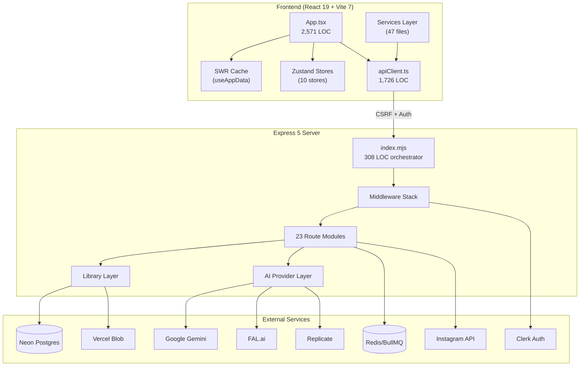
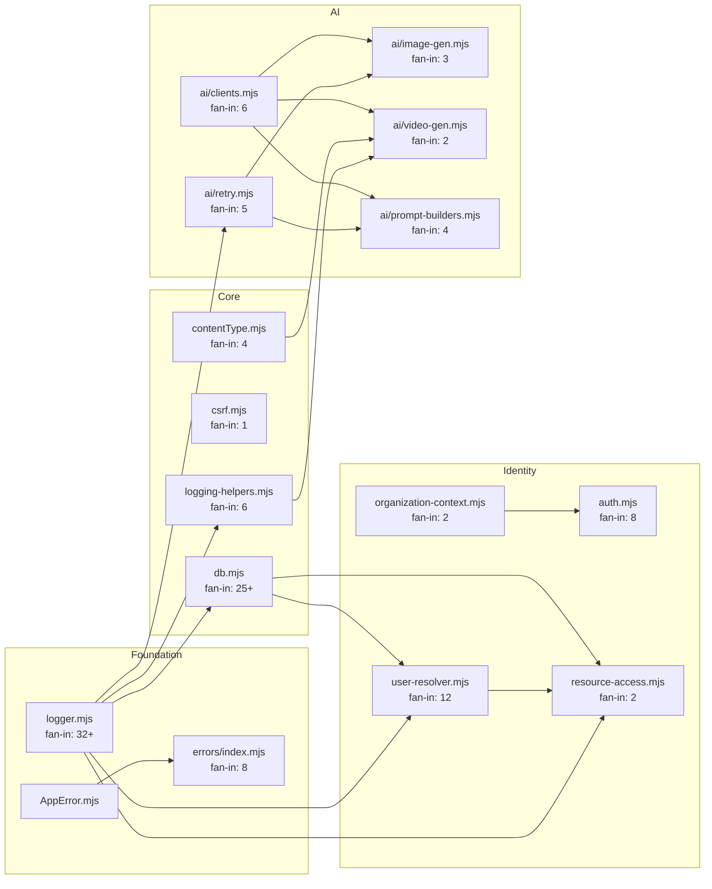
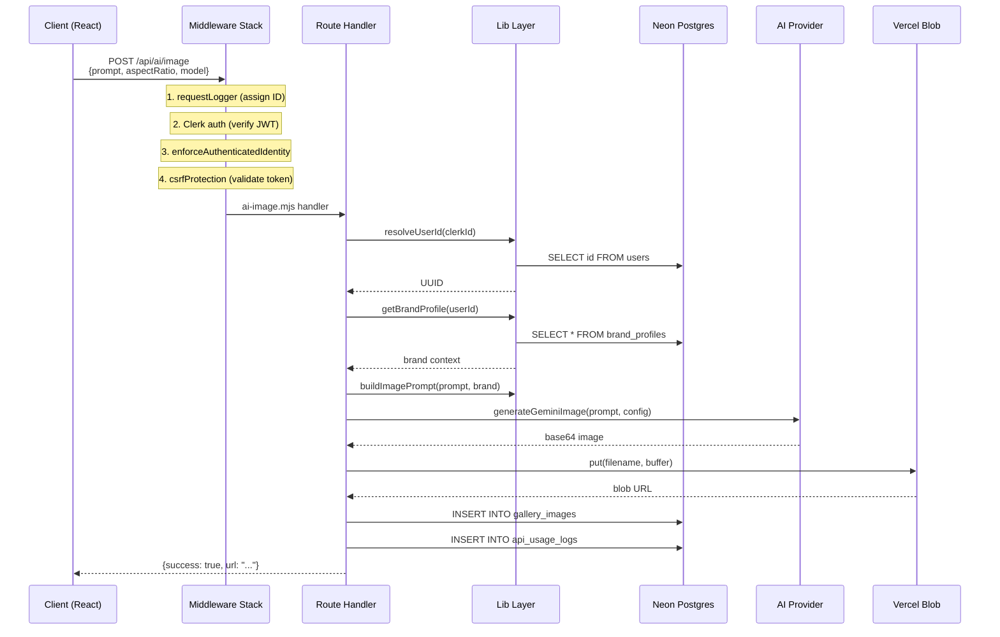
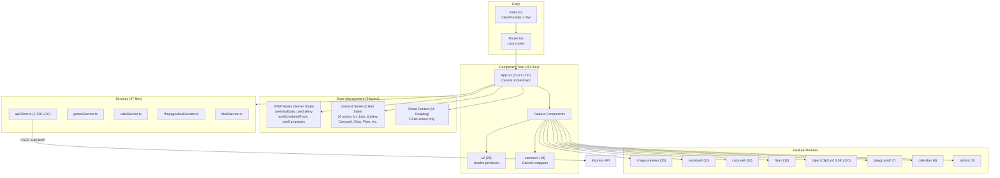
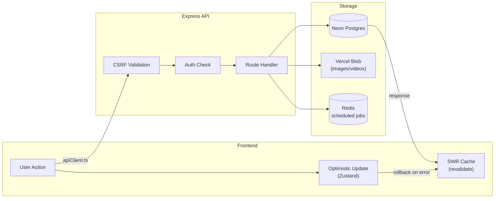
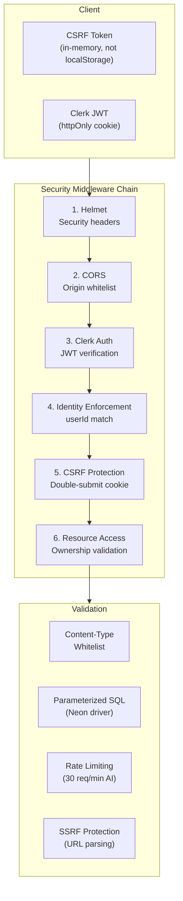

# Socialab - Architecture Review & Diagrams

> **Date**: 2026-02-11
> **Context**: Post server refactoring (7,967 LOC monolith → 308 LOC orchestrator + 57 modular files)
> **Total Server LOC**: ~15,500 across 57 .mjs files

---

## 1. System Architecture Overview

---

## 2. Server Layer Architecture

```mermaid
graph TB
    subgraph L0["Layer 0: Foundation"]
        Logger["logger.mjs<br/>Pino structured logging"]
        Errors["errors/<br/>AppError + 11 subclasses"]
        Validation["validation/<br/>contentType whitelist"]
    end

    subgraph L1["Layer 1: Core Infrastructure"]
        DB["db.mjs<br/>Neon singleton + warmup"]
        CSRF["csrf.mjs<br/>HMAC-SHA256 tokens"]
        LogHelpers["logging-helpers.mjs<br/>API call logging"]
    end

    subgraph L2["Layer 2: Identity & Access"]
        UserResolver["user-resolver.mjs<br/>Clerk→UUID + 5min cache"]
        Auth["auth.mjs<br/>Auth + rate limiting"]
        OrgCtx["organization-context.mjs<br/>13 permissions, 2 roles"]
        ResourceAccess["resource-access.mjs<br/>RLS for 13 resource types"]
    end

    subgraph L3["Layer 3: AI Providers"]
        Clients["ai/clients.mjs<br/>Gemini, OpenRouter, FAL, Replicate"]
        Retry["ai/retry.mjs<br/>503 retry + error sanitization"]
        ImageGen["ai/image-generation.mjs<br/>Gemini + Replicate fallback"]
        VideoGen["ai/video-generation.mjs<br/>Veo 3.1 + FAL"]
        PromptBuild["ai/prompt-builders.mjs<br/>Brand-aware prompts"]
        Providers["ai/providers.mjs<br/>Vercel AI SDK wrapper"]
        Tools["ai/tools/<br/>createImage, editImage, createLogo"]
    end

    subgraph L4["Layer 4: Middleware"]
        ReqLogger["requestLogger.mjs<br/>pino-http + request IDs"]
        ErrorHandler["errorHandler.mjs<br/>Global catch-all"]
        CSRFMiddleware["csrfProtection.mjs<br/>Double-submit cookie"]
    end

    subgraph L5["Layer 5: Helpers"]
        JobQueue["job-queue.mjs<br/>BullMQ scheduled posts"]
        UsageTracking["usage-tracking.mjs<br/>Cost tracking, 20+ models"]
        ScheduledPub["scheduled-publisher.mjs<br/>Instagram auto-publish"]
        CampaignPrompts["campaign-prompts.mjs"]
    end

    subgraph L6["Layer 6: Routes (23 modules)"]
        Health["health.mjs"]
        Admin["admin.mjs"]
        Init["init.mjs"]
        DBRoutes["db-*.mjs (8 files)<br/>Users, Brand, Gallery, Posts,<br/>Campaigns, Tournaments,<br/>Scheduled, Instagram"]
        AIRoutes["ai-*.mjs (6 files)<br/>Campaign, Text, Image,<br/>Video, Speech, Assistant"]
        Upload["upload.mjs"]
        GenJobs["generation-jobs.mjs"]
        Playground["*-playground.mjs (2)"]
        Rube["rube.mjs"]
    end

    subgraph L7["Layer 7: Orchestrator"]
        IndexMjs["index.mjs (308 LOC)<br/>Setup + Middleware + Registration"]
    end

    L0 --> L1
    L1 --> L2
    L2 --> L3
    L1 --> L3
    L0 --> L4
    L2 --> L5
    L3 --> L5
    L1 --> L6
    L2 --> L6
    L3 --> L6
    L5 --> L6
    L4 --> L7
    L6 --> L7
```

---

## 3. Dependency Graph (Internal Modules)

**Key Property: Zero Circular Dependencies** - All arrows flow in one direction (DAG validated).

---

## 4. Request Flow

---

## 5. Frontend Architecture

---

## 6. Data Flow Architecture

---

## 7. Security Architecture

### Security Matrix

| Control | Status | Coverage |
|---------|--------|----------|
| Authentication (Clerk) | **STRONG** | All /api/db/*, /api/ai/*, /api/admin/* |
| CSRF (Double-Submit) | **EXCELLENT** | All state-changing operations |
| SQL Injection | **EXCELLENT** | 100% parameterized (Neon driver) |
| XSS (Upload) | **EXCELLENT** | Content-type whitelist blocks HTML/SVG/JS |
| SSRF (Proxy) | **FIXED** | URL parsing with hostname validation |
| API Key Isolation | **FIXED** | Gemini key never exposed to client |
| Rate Limiting | **PARTIAL** | Only /api/chat - AI endpoints unprotected |
| Input Validation | **GOOD** | Most endpoints validate, some accept arbitrary |
| Error Sanitization | **GOOD** | `sanitizeErrorForClient()` strips internals |

---

## 8. Dependency Metrics

### High Fan-In (Most Depended Upon)

| Module | Fan-In | Expected? |
|--------|--------|-----------|
| logger.mjs | 32+ | Yes - foundation |
| db.mjs | 25+ | Yes - data layer |
| user-resolver.mjs | 12 | Yes - identity |
| auth.mjs | 8 | Yes - security |
| errors/index.mjs | 8 | Yes - error handling |
| ai/clients.mjs | 6 | Yes - AI singleton |
| logging-helpers.mjs | 6 | Yes - observability |

### High Fan-Out (Most Dependencies)

| Module | Fan-Out | Risk |
|--------|---------|------|
| index.mjs | 40+ | Expected (orchestrator) |
| ai-image.mjs | 8 | Medium (complex route) |
| ai-campaign.mjs | 7 | Medium (complex route) |
| ai-assistant.mjs | 7 | Medium (complex route) |

### Coupling Health: **HEALTHY**
- Zero circular dependencies
- Clear directional flow (bottom → top)
- 1 minor layering violation (routes/rube.mjs → routes/db-instagram.mjs)

---

## 9. Issues Found & Recommendations

### CRITICAL (Fix Now)

| # | Issue | Impact | Location |
|---|-------|--------|----------|
| 1 | **AI endpoints lack rate limiting** | Cost exposure - users can hammer expensive AI APIs (video=$0.50+/call) | All `/api/ai/*` routes except /chat |
| 2 | **`/api/db/stats` unprotected** | Debug endpoint exposed without auth - cache info leak + DoS via reset | `routes/health.mjs:32-44` |

### MEDIUM (Plan for Next Sprint)

| # | Issue | Impact | Location |
|---|-------|--------|----------|
| 3 | **Cross-route import** | Layering violation - rube.mjs imports from db-instagram.mjs | `routes/rube.mjs:3` |
| 4 | **In-memory rate limiter** | Lost on server restart, not shared across instances | `lib/auth.mjs:18` |
| 5 | **App.tsx monolith** (2,571 LOC) | Frontend equivalent of old server monolith | `src/App.tsx` |
| 6 | **ClipCard.tsx** (~5,500 LOC) | Largest single component, hard to maintain | `src/components/tabs/clips/ClipCard.tsx` |
| 7 | **apiClient.ts** (1,726 LOC) | Growing API layer, should split by domain | `src/services/apiClient.ts` |

### LOW (Technical Debt Backlog)

| # | Issue | Impact | Location |
|---|-------|--------|----------|
| 8 | 66+ TypeScript `any` types | Type safety gaps | Across frontend |
| 9 | CLAUDE.md outdated | Still says "~7K lines monolithic" | `CLAUDE.md:43` |
| 10 | Playground helpers not in routes pattern | `helpers/image-playground.mjs` (1,181 LOC) is a helper, not a route | `server/helpers/` |

---

## 10. Module Inventory Summary

| Layer | Files | Total LOC | % of Server |
|-------|-------|-----------|-------------|
| Orchestrator (index.mjs) | 1 | 308 | 2% |
| Middleware | 3 | 665 | 4% |
| Library - Core | 8 | 879 | 6% |
| Library - Errors | 2 | 352 | 2% |
| Library - Validation | 2 | 268 | 2% |
| Library - AI | 8 | 1,641 | 11% |
| Helpers | 11 | 3,551 | 23% |
| API (Chat) | 2 | 557 | 4% |
| Routes | 24 | 7,264 | 47% |
| **Total** | **61** | **~15,500** | **100%** |

---

## 11. Architecture Score Card

| Dimension | Score | Notes |
|-----------|-------|-------|
| **Modularity** | 9/10 | Excellent post-refactor. 57 focused modules, clear boundaries |
| **Separation of Concerns** | 8/10 | Clean layers. -1 for playground helpers coupling, -1 for rube cross-import |
| **Security** | 8/10 | Strong auth/CSRF/SQL. -1 for missing rate limits, -1 for exposed stats |
| **Testability** | 7/10 | Modules are independently testable. Few actual tests exist |
| **Observability** | 9/10 | Structured logging everywhere, usage tracking, request IDs |
| **Scalability** | 7/10 | Stateless routes (good), in-memory rate limiter (bad), single process |
| **Maintainability** | 8/10 | Consistent patterns, clear naming. Large frontend files remain |
| **Documentation** | 7/10 | Good CLAUDE.md + docs/. Needs update post-refactor |
| **Overall** | **8/10** | **Solid architecture with clear improvement paths** |
